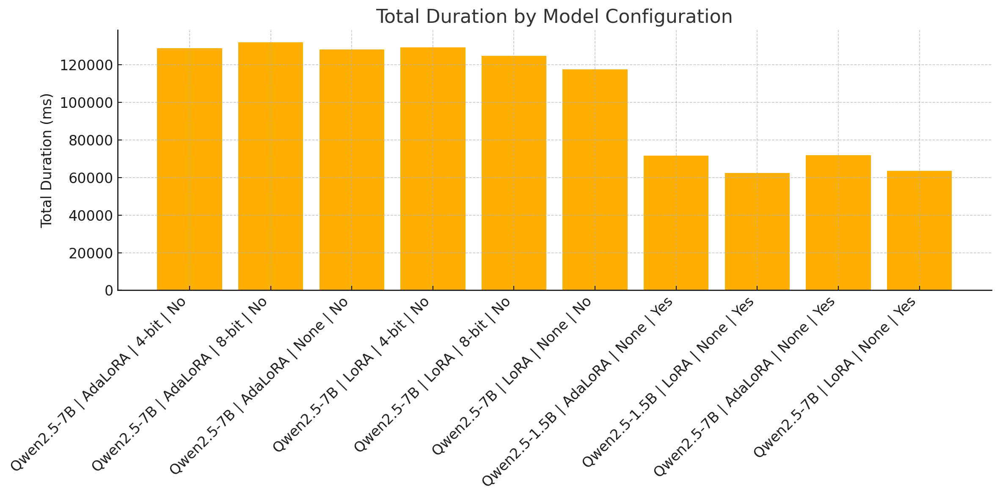

## Description
Our project,Adaptive and Quantized Fine‑Tuning for Large‑Language Models: A Unified Optimization Framework, explores how to efficiently fine‑tune state‑of‑the‑art LLMs under strict GPU‑memory constraints. By combining parameter‑efficient methods (LoRA and AdaLoRA) with low‑bit quantization (4‑bit and 8‑bit) and integrating Flash‑Attention via DeepSpeed, we enable scalable training of Qwen‑2.5‑1.5B and Qwen‑2.5‑7B models on a single NVIDIA A100. Evaluated on the Alpaca dataset, the 7B LoRA model equipped with Flash‑Attention achieved the best balance of semantic quality (ROUGE‑L 35.69, BERT‑F1 38.51) and latency, while quantization offers a viable path for memory‑constrained, high‑throughput deployments. Overall, Flash‑Attention delivers 40–60% wall‑clock speed‑ups (at the cost of higher CPU utilization), LoRA provides a lightweight tuning baseline, AdaLoRA adds adaptive capacity with modest slowdowns, and quantization yields marginal speed gains with some quality trade‑offs.

## Project Milestones and Completion Status

Scalable Training Backbone
– Goal: Enable data‑parallel training and replace vanilla attention kernels with FlashAttention.
– Status: Completed. DeepSpeed data‑parallel training is in place, FlashAttention has been fully integrated into our fork, yielding a ~1.8× increase in tokens/sec on a single A100.

Adaptive Parameter‑Efficient Tuning
– Goal: Apply AdaLoRA to the q/k/v/o projections of Qwen‑2.5‑1.5B and Qwen‑2.5‑7B (and support QLoRA).
– Status: Completed. Both models now support AdaLoRA and QLoRA; with 90% of Alpaca as training data, the 7B AdaLoRA model reached a training loss of ~0.014 and the 1.5B model ~0.016 (compared to 0.098 and 0.13 for 16‑bit LoRA).

4‑bit and 8‑bit Quantization
– Goal: Quantize remaining full‑precision weights to 4‑bit via QLoRA (and, time permitting, prune low‑magnitude channels for 8‑bit).
– Status: 4‑bit QLoRA – Completed. All weights successfully quantized to 4‑bit.
8‑bit pruning – In Progress. Magnitude‑based channel pruning is under experimentation.

Profiling and Evaluation
– Goal: Track every run with torch.profiler and assess trained models using BLEU, ROUGE‑L, and BERT‑F1.
– Status: Completed. Full profiling pipeline is operational, with performance metrics collected and analyzed across all tuning and quantization configurations.


## Code structure 
Root directory

README.MD – Project overview, installation steps, dataset/inference/training instructions 
GitHub

args.MD – Detailed descriptions of all training hyperparameters and their meanings 
GitHub

requirements.txt – Python dependencies (PyTorch, DeepSpeed, flash‑attention, etc.) 
GitHub

train.py – Main entry point for fine‑tuning models (handles config loading, model/optimizer setup, and launch) 
GitHub

data_processer.py – Defines data loading and preprocessing pipeline for Alpaca and other datasets 
GitHub

data_tools.py – Helper functions for dataset manipulation (e.g. batching, tokenization utilities) 
GitHub

data_utils.py – General-purpose utilities (file I/O, sampling, mixed‑precision wrappers) 
GitHub

config/
Contains YAML/JSON files specifying model hyperparameters (LoRA ranks, learning rates, quantization bits, FlashAttention) and DeepSpeed settings 
GitHub

data/
Placeholder or scripts for fetching/preprocessing datasets (e.g. splits of the Alpaca dataset) 
GitHub

infer/
Inference scripts, notably infer_lora_finetuning.py, to run LoRA/AdaLoRA‐quantized checkpoints on new inputs 
GitHub

scripts/
Shell wrappers to launch training with different modes:

train_full.sh – full‑parameter training

train_lora.sh – LoRA/AdaLoRA‑only fine‑tuning 
GitHub

training/
Supplementary files and logs for tracking runs, including any parameter sweeps or profiler outputs

## install
  - pip install -U -r requirements.txt
  
```text

# Flash-attention requires a graphics card with an arithmetic power of 7.5 or higher, the following optional installation, if the card does not support it, you can not install it.
git clone -b https://github.com/Dao-AILab/flash-attention
cd flash-attention && pip install .
pip install csrc/layer_norm
pip install csrc/rotary
```


## weight
 - [Qwen2.5-7B](https://huggingface.co/Qwen/Qwen2.5-7B)
  - [ &&Qwen2.5-1.5B-Instruct](https://huggingface.co/Qwen/Qwen2.5-1.5B-Instruct)


## dataset
- 20% of alpaca for training, 500 samples for infer(https://huggingface.co/datasets/tatsu-lab/alpaca)


## infer
    # infer_lora_finetuning.py #Inferring lora fine-tuning models
     python infer_lora_finetuning.py.py


## training
```text
 # Production data
 cd scripts
 bash train_full.sh -m dataset 
 or
 bash train_lora.sh -m dataset 

##num_process_worker is for multi-process data production, if the amount of data is large, appropriately adjusted to the number of cpu
 dataHelper.make_dataset_with_args(data_args.train_file,mixed_data=False, shuffle=True,mode='train',num_process_worker=0)
 
 # full parameter training
     bash train_full.sh -m train
     
 # lora adalora 
     bash train_lora.sh -m train
     
```


## training parameter
[training parameter](args.MD)


## Observations & Conclusions


	Quality Metrics
	We achieved ROUGE‑L of 35.69 and BERT‑F1 of 38.51 using the 7 billion‑parameter model with LoRA and FlashAttention, demonstrating superior semantic fidelity.

	The highest BLEU score of 13.93 was obtained by the same 7 billion‑parameter LoRA model without FlashAttention, indicating that raw n‑gram overlap peaks in that configuration.

  Semantic scores (ROUGE‑L, BERT‑F1) actually improve with FlashAttention on the 7 B LoRA model, while BLEU drops by only 0.1‑0.2 points.

The 7 B LoRA configuration with FlashAttention is our recommended setup for applications demanding both high semantic fidelity and low latency. Quantized variants remain a strong option for extremely memory‑constrained or throughput‑focused deployment scenarios.”





Latency (6‑step Wall‑Clock)
	Enabling FlashAttention reduces end‑to‑end wall‑time by 40–60% across all configurations. For example, the 7 B AdaLoRA run drops from roughly 2.43 s to 1.45 s.

	Even the smaller 1.5 B variants see similar proportional speed‑ups (from ~1.32 s down to ~0.99 s).
Resource Utilization
	CPU remains the dominant resource, consuming over 99% of profiled time in every test.

	GPU share falls from around 2.3–3.4% without FlashAttention to just 0.4–0.7% when FlashAttention is active, indicating that most work is still orchestrated on the host side.


Conclusion:
	1.	FlashAttention delivers consistent, large speed‑ups (40–60%) across model sizes and adaptation methods, making it an effective way to reduce latency on a single A100 GPU.
	2.	Quality trade‑offs are minimal: Semantic scores (ROUGE‑L, BERT‑F1) actually improve with FlashAttention on the 7 B LoRA model, while BLEU drops by only 0.1‑0.2 points.
	3.	Quantization (4‑bit/8‑bit) further cuts memory and execution time but incurs a larger quality penalty (~1–1.5 points), suggesting a use case when hardware constraints outweigh marginal metric losses.
The 7 B LoRA configuration with FlashAttention is our recommended setup for applications demanding both high semantic fidelity and low latency. Quantized variants remain a strong option for extremely memory‑constrained or throughput‑focused deployment scenarios.

## Reference
https://github.com/ssbuild/qwen_finetuning
    


